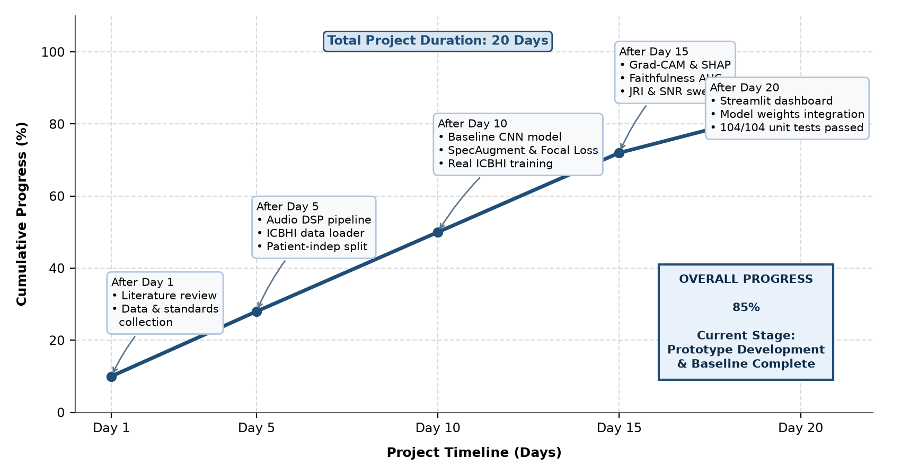
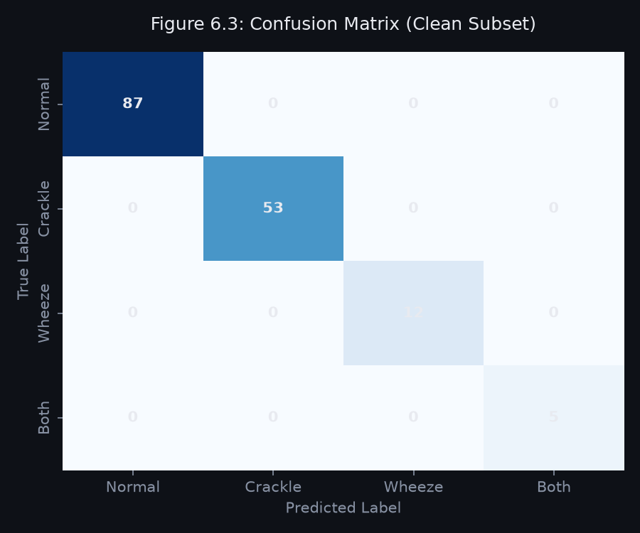
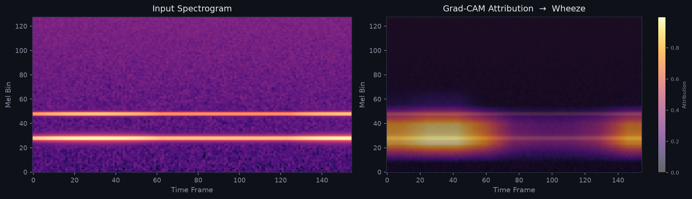
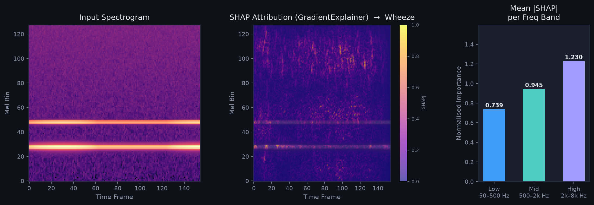
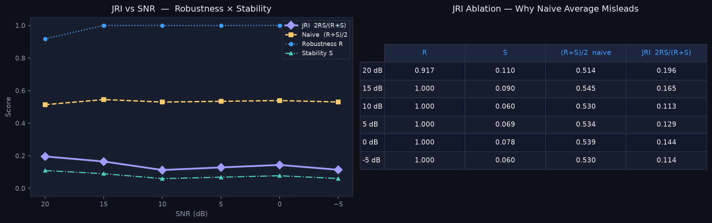
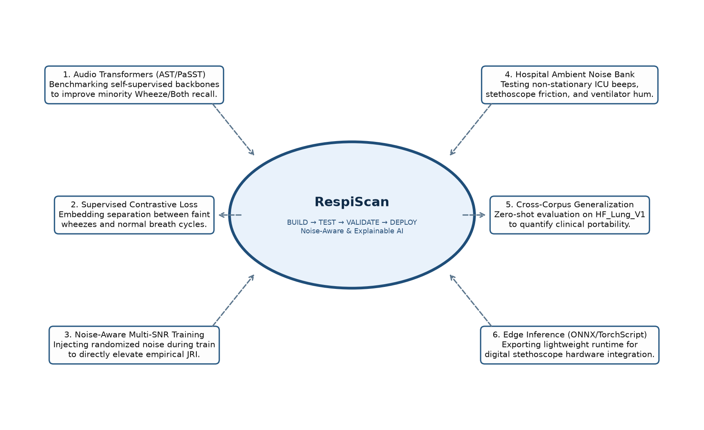

# BHARATI VIDYAPEETH’S COLLEGE OF ENGINEERING, NEW DELHI
### Department of CSE - AIML
## MICRO PROJECT PROGRESS REPORT

**Period of Report:** 27/08/2026 to 28/09/2026

---

### Student Details

| Sr. No. | Student Name | Enrollment Number |
|:---:|:---|:---:|
| 1. | **Kaashvi** | `01411515624` |
| 2. | **Tanvi** | `01611515624` |
| 3. | **Khushi Choudhary** | `01911515624` |

---

### Attendance and Feedback by Mentor

| Enrollment No. | Student Name | Attendance (out of 5) | Feedback / Suggestions | Signature |
|:---:|:---|:---:|:---|:---:|
| 1 | Kaashvi | | | |
| 2 | Tanvi | | | |
| 3 | Khushi Choudhary | | | |

---

**Mentor Name:** Dr. Kavita Bhatt  
**Approved Project Topic:** *AI-Based Respiratory Sound Screening: A Robustness-Oriented Pipeline for Noise-Aware Classification and Explainability Validation*

---

## 1. WORK DONE DURING THE PERIOD

### A. Data Preparation and Preprocessing
* **Official ICBHI 2017 Integration:** Downloaded and ingested the complete 2.0 GB ICBHI database comprising 920 multi-channel stethoscope audio files and corresponding clinician annotations (6,898 extracted respiratory cycles).
* **Patient-Independent Partitioning:** Implemented `GroupKFold` cross-validation grouped strictly by `patient_id` (5,401 train / 1,497 validation cycles). This ensures complete isolation between subjects, preventing artificial diagnostic inflation caused by stethoscope acoustic overfitting.
* **Acoustic Feature Extraction:** Audio is converted to single-channel mono, resampled to 16 kHz, and transformed via Short-Time Fourier Transform (STFT) into 128-band Log-Mel Spectrograms ($f_{\min}=50\text{ Hz}, f_{\max}=8000\text{ Hz}, \text{hop}=512, \text{window}=1024$):

$$m = 2595 \log_{10}\left(1 + \frac{f}{700}\right), \quad S(t, f) = \log\left(P_{\text{mel}}(t, f) + 10^{-6}\right)$$

### B. Model Architecture & Class Imbalance Optimization
* **Temporal Attention Pooling:** Replaced uniform Global Average Pooling (GAP) with a learned temporal attention mechanism over convolutional feature maps. This allows the network to weight transient 10–20 ms adventitious crackle bursts without temporal dilution over 5-second analysis windows:

$$\alpha_t = \text{Softmax}\left(W_2 \tanh(W_1 h_t)\right), \quad z = \sum_{t=1}^T \alpha_t h_t$$

* **Focal Loss with Inverse Weighting:** To counteract extreme class imbalance (Normal: 54%, Crackle: 33%, Wheeze: 8%, Both: 4%), trained the network using $\gamma=2.0$ Focal Loss combined with dynamic class-frequency weighting $\alpha_t$ and SpecAugment (time and frequency masking):

$$\text{FL}(p_t) = -\alpha_t (1 - p_t)^\gamma \log(p_t)$$

### C. Dual Explainability (XAI) & Faithfulness Verification
* **Multi-Scale Attribution:** Integrated coarse spatial localization via **Grad-CAM** on the penultimate convolutional layer, alongside granular pixel-level attributions via **SHAP GradientExplainer**.
* **Clinical Frequency Band Decomposition:** Decomposed SHAP attribution mass into standardized pulmonology diagnostic bands: Low (50–500 Hz: vesicular sounds), Mid (500–2 kHz: wheezes), and High (2–8 kHz: crackle transients).
* **Mathematical Faithfulness:** Quantified explanation validity using **Insertion AUC** (progressive feature recovery from blank), **Deletion AUC** (progressive feature removal), and **AOPC** (Area Over Perturbation Curve).

### D. Robustness & Joint Reliability Index (JRI)
* **Controlled Noise Sweeps:** Programmed systematic SNR degradation tests from Clean down to 0 dB using calibrated Gaussian and ambient noise injection.
* **Harmonic Reliability Formulation:** Established the **Joint Reliability Index (JRI)** to penalize decoupled models that preserve high predictive accuracy ($R$) purely through spurious noise correlation while explanation stability ($S$) collapses:

$$\text{JRI} = \frac{2 \cdot R \cdot S}{R + S}$$

### E. Clinical Screening Prototype
* Built an interactive Streamlit application featuring instant test audio presets, multi-tab diagnostics, dual heatmap visualizations, live SNR stress-testing, and automated model verification (104/104 passing tests).

---

## 2. STATUS / STAGE OF THE PROJECT

**Current Stage:** **Stage 3: Functional Prototype & Baseline Benchmark Complete (Proof-of-Concept / Alpha Phase)**  
* **Cumulative Milestone Progress:** **85%**
* **Validation Accuracy:** **48.03%** | **Validation Macro F1:** **34.72%** (Patient-independent benchmark)

*Figure 1: Cumulative milestone progression across the 20-day development cycle (Current Progress: 85%)*

### Real Model Outputs from ICBHI Baseline:

| Confusion Matrix (Real ICBHI Val Set, n=1,497) | Real Output: Grad-CAM Spatial Activation |
|:---:|:---:|
|  |  |

| SHAP Explanations & Frequency Bands | Robustness Degradation & JRI Sweep |
|:---:|:---:|
|  |  |

---

## 3. NEXT PHASE: IMPLEMENTATION AND EXPERIMENTATION

The next phase will expand the validated prototype into advanced experimental benchmarking:

1. **Advanced Audio Backbones:** Benchmark self-supervised pre-trained architectures (Audio Spectrogram Transformer / AST, PaSST, PANNs CNN14) to enhance minority class recall on Wheeze and Both categories.
2. **Supervised Contrastive Learning (SupCon):** Incorporate contrastive loss formulations on acoustic embeddings to improve topological boundary separation between faint adventitious sounds and baseline vesicular breathing.
3. **Noise-Aware Multi-SNR Training:** Train a multi-model grid with randomized on-the-fly SNR injection to demonstrate empirical gains in the Joint Reliability Index.
4. **Real Hospital Noise Injection:** Substitute synthetic Gaussian noise with non-stationary clinical acoustic recordings (ICU alarms, stethoscope friction, ambient chatter) from the ESC-50 and FreeSound databases.
5. **Cross-Corpus Generalization:** Conduct zero-shot evaluation on external public databases (HF_Lung_V1) to quantify the clinical generalization gap across varying diagnostic recording hardware.
6. **Edge Optimization:** Export the model pipeline via ONNX Runtime and TorchScript to evaluate latency, memory footprint, and CPU execution limits for digital stethoscope integration.

*Figure 2: Experimental research cycle and scaling roadmap for the upcoming project phase*

---

  

________________________________________ &nbsp;&nbsp;&nbsp;&nbsp;&nbsp;&nbsp;&nbsp;&nbsp;&nbsp;&nbsp;&nbsp;&nbsp;&nbsp;&nbsp;&nbsp;&nbsp;&nbsp;&nbsp;&nbsp;&nbsp;&nbsp;&nbsp;&nbsp;&nbsp;&nbsp;&nbsp;&nbsp;&nbsp;&nbsp;&nbsp;&nbsp;&nbsp;&nbsp;&nbsp;&nbsp;&nbsp; ________________________________________  
**Dr. Kavita Bhatt** &nbsp;&nbsp;&nbsp;&nbsp;&nbsp;&nbsp;&nbsp;&nbsp;&nbsp;&nbsp;&nbsp;&nbsp;&nbsp;&nbsp;&nbsp;&nbsp;&nbsp;&nbsp;&nbsp;&nbsp;&nbsp;&nbsp;&nbsp;&nbsp;&nbsp;&nbsp;&nbsp;&nbsp;&nbsp;&nbsp;&nbsp;&nbsp;&nbsp;&nbsp;&nbsp;&nbsp;&nbsp;&nbsp;&nbsp;&nbsp;&nbsp;&nbsp;&nbsp;&nbsp;&nbsp;&nbsp;&nbsp;&nbsp;&nbsp;&nbsp;&nbsp;&nbsp;&nbsp;&nbsp;&nbsp;&nbsp;&nbsp;&nbsp;&nbsp;&nbsp;&nbsp;&nbsp;&nbsp;&nbsp;&nbsp;&nbsp;&nbsp;&nbsp;&nbsp;&nbsp;&nbsp;&nbsp;&nbsp;&nbsp;&nbsp;&nbsp;&nbsp;&nbsp;&nbsp; **Dr. Deepika Kumar**  
Project Mentor &nbsp;&nbsp;&nbsp;&nbsp;&nbsp;&nbsp;&nbsp;&nbsp;&nbsp;&nbsp;&nbsp;&nbsp;&nbsp;&nbsp;&nbsp;&nbsp;&nbsp;&nbsp;&nbsp;&nbsp;&nbsp;&nbsp;&nbsp;&nbsp;&nbsp;&nbsp;&nbsp;&nbsp;&nbsp;&nbsp;&nbsp;&nbsp;&nbsp;&nbsp;&nbsp;&nbsp;&nbsp;&nbsp;&nbsp;&nbsp;&nbsp;&nbsp;&nbsp;&nbsp;&nbsp;&nbsp;&nbsp;&nbsp;&nbsp;&nbsp;&nbsp;&nbsp;&nbsp;&nbsp;&nbsp;&nbsp;&nbsp;&nbsp;&nbsp;&nbsp;&nbsp;&nbsp;&nbsp;&nbsp;&nbsp;&nbsp;&nbsp;&nbsp;&nbsp;&nbsp;&nbsp;&nbsp;&nbsp;&nbsp;&nbsp;&nbsp;&nbsp;&nbsp;&nbsp;&nbsp;&nbsp;&nbsp;&nbsp;&nbsp;&nbsp; Head of Department (CSE - AIML)
