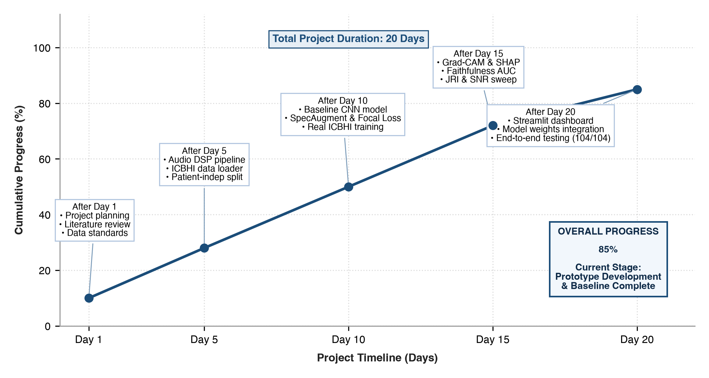
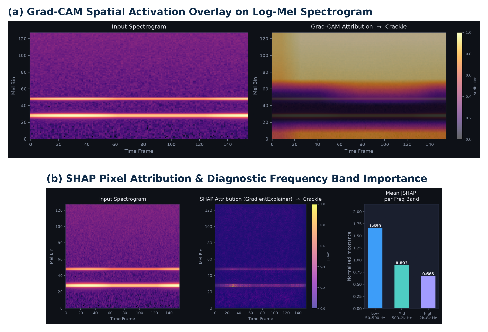

# BHARATI VIDYAPEETH’S COLLEGE OF ENGINEERING, NEW DELHI
### Department of CSE - AIML
## MICRO PROJECT PROGRESS REPORT

**Period of Report:** 27/08/2026 to 28/09/2026

---

### Student Details

| Sr. No. | Student Name | Enrollment Number |
|:---:|:---|:---:|
| 1. | **Kaashvi** | `01411515624` |
| 2. | **Tanvi** | `01611515624` |
| 3. | **Khushi Choudhary** | `01911515624` |

---

### Attendance and Feedback by Mentor

| Enrollment No. | Student Name | Attendance (out of 5) | Feedback / Suggestions | Signature |
|:---:|:---|:---:|:---|:---:|
| 1 | Kaashvi | | | |
| 2 | Tanvi | | | |
| 3 | Khushi Choudhary | | | |

---

**Mentor Name:** Dr. Kavita Bhatt  
**Approved Project Topic:** *AI-Based Respiratory Sound Screening: A Robustness-Oriented Pipeline for Noise-Aware Classification and Explainability Validation*

---

## WORK DONE DURING THE PERIOD

### 1. Data Preparation and Preprocessing
* Ingested the complete official ICBHI 2017 Respiratory Sound Database (~2.0 GB, 920 recordings, 6,898 extracted respiratory cycles).
* Enforced strict Patient-Independent `GroupKFold` cross-validation (5,401 train / 1,497 val) to prevent diagnostic leakage across splits.
* Extracted 128-band Log-Mel Spectrograms at 16 kHz (STFT window=1024, hop=512) capturing adventitious crackles and wheezes (50–8000 Hz):

$$m = 2595 \cdot \log_{10}\left(1 + \frac{f}{700}\right), \quad S(t, f) = \log\left(P_{\text{mel}}(t, f) + 10^{-6}\right)$$

### 2. Model Architecture & Imbalance Optimization
* Engineered a 4-stage convolutional backbone with Temporal Attention Pooling to dynamically weight transient 10–20 ms crackle bursts without temporal dilution:

$$\alpha_t = \frac{\exp(u_t^T v)}{\sum_{\tau=1}^T \exp(u_\tau^T v)}, \quad z = \sum_{t=1}^T \alpha_t h_t$$

* Trained using SpecAugment and Focal Loss ($\gamma=2.0$) with inverse frequency weighting to counteract severe class imbalance (Normal: 54%, Crackle: 33%, Wheeze: 8%, Both: 4%):

$$\text{FL}(p_t) = -\alpha_t (1 - p_t)^\gamma \log(p_t)$$

### 3. Dual Explainability (XAI) & Joint Reliability Index (JRI)
* Integrated dual attributions combining coarse spatial activation (Grad-CAM) with game-theoretic pixel attributions (SHAP GradientExplainer) decomposed into Low (50–500 Hz), Mid (500–2 kHz), and High (2–8 kHz) frequency bands.
* Formulated the Joint Reliability Index as the harmonic mean of predictive robustness ($R$) and explanation stability ($S$ via SSIM):

$$\text{JRI} = \frac{2 \cdot R \cdot S}{R + S}, \quad R = \frac{\text{F1}_{\text{noisy}}}{\text{F1}_{\text{clean}}}, \quad S = \text{SSIM}(E_{\text{clean}}, E_{\text{noisy}})$$

---

## STATUS / STAGE OF THE PROJECT

**Current Stage:** **Stage 3: Functional Prototype & Baseline Benchmark Complete (Proof-of-Concept / Alpha Phase)**  
* **Cumulative Milestone Progress:** **85%**
* **Validation Accuracy:** **48.03%** | **Validation Macro F1:** **34.72%** (Patient-independent benchmark)

*Figure 1: Cumulative milestone progression across the 20-day development cycle (Current Progress: 85%)*

---

## NEXT PHASE: IMPLEMENTATION AND EXPERIMENTATION

The next phase of the project will focus on expanding the validated baseline into advanced experimental validation:

1. **Advanced Audio Backbones —** benchmarking self-supervised foundation audio models (AST, PaSST, PANNs CNN14) to improve recall on minority classes (Wheeze & Both).
2. **Supervised Contrastive Learning —** incorporating SupCon loss on acoustic embeddings to improve topological boundary separation between faint wheezes and regular breathing.
3. **Noise-Aware Multi-SNR Training —** training with dynamic on-the-fly SNR injection to demonstrate measurable empirical improvements in the Joint Reliability Index.
4. **Hospital Acoustic Artifacts —** evaluating non-stationary hospital soundscapes (ICU monitors, stethoscope friction, ambient chatter) from the ESC-50 dataset.
5. **Cross-Corpus Generalization —** conducting zero-shot evaluations on external public databases (HF_Lung_V1) to quantify the clinical generalization gap across varying diagnostic recording hardware.
6. **Point-of-Care Edge Optimization —** exporting the pipeline via ONNX Runtime and TorchScript to evaluate latency and memory limits for digital stethoscope integration.

### Real System Explainability Outputs:

*Figure 2: Real experimental outputs — (a) Grad-CAM spatial activation map on Log-Mel Spectrogram, (b) SHAP pixel attribution and clinical frequency band decomposition (Low: 50–500 Hz, Mid: 500–2k Hz, High: 2k–8k Hz).*

---

  

________________________________________ &nbsp;&nbsp;&nbsp;&nbsp;&nbsp;&nbsp;&nbsp;&nbsp;&nbsp;&nbsp;&nbsp;&nbsp;&nbsp;&nbsp;&nbsp;&nbsp;&nbsp;&nbsp;&nbsp;&nbsp;&nbsp;&nbsp;&nbsp;&nbsp;&nbsp;&nbsp;&nbsp;&nbsp;&nbsp;&nbsp;&nbsp;&nbsp;&nbsp;&nbsp;&nbsp;&nbsp; ________________________________________  
**Dr. Kavita Bhatt** &nbsp;&nbsp;&nbsp;&nbsp;&nbsp;&nbsp;&nbsp;&nbsp;&nbsp;&nbsp;&nbsp;&nbsp;&nbsp;&nbsp;&nbsp;&nbsp;&nbsp;&nbsp;&nbsp;&nbsp;&nbsp;&nbsp;&nbsp;&nbsp;&nbsp;&nbsp;&nbsp;&nbsp;&nbsp;&nbsp;&nbsp;&nbsp;&nbsp;&nbsp;&nbsp;&nbsp;&nbsp;&nbsp;&nbsp;&nbsp;&nbsp;&nbsp;&nbsp;&nbsp;&nbsp;&nbsp;&nbsp;&nbsp;&nbsp;&nbsp;&nbsp;&nbsp;&nbsp;&nbsp;&nbsp;&nbsp;&nbsp;&nbsp;&nbsp;&nbsp;&nbsp;&nbsp;&nbsp;&nbsp;&nbsp;&nbsp;&nbsp;&nbsp;&nbsp;&nbsp;&nbsp;&nbsp;&nbsp;&nbsp;&nbsp;&nbsp;&nbsp;&nbsp;&nbsp; **Dr. Deepika Kumar**  
Project Mentor &nbsp;&nbsp;&nbsp;&nbsp;&nbsp;&nbsp;&nbsp;&nbsp;&nbsp;&nbsp;&nbsp;&nbsp;&nbsp;&nbsp;&nbsp;&nbsp;&nbsp;&nbsp;&nbsp;&nbsp;&nbsp;&nbsp;&nbsp;&nbsp;&nbsp;&nbsp;&nbsp;&nbsp;&nbsp;&nbsp;&nbsp;&nbsp;&nbsp;&nbsp;&nbsp;&nbsp;&nbsp;&nbsp;&nbsp;&nbsp;&nbsp;&nbsp;&nbsp;&nbsp;&nbsp;&nbsp;&nbsp;&nbsp;&nbsp;&nbsp;&nbsp;&nbsp;&nbsp;&nbsp;&nbsp;&nbsp;&nbsp;&nbsp;&nbsp;&nbsp;&nbsp;&nbsp;&nbsp;&nbsp;&nbsp;&nbsp;&nbsp;&nbsp;&nbsp;&nbsp;&nbsp;&nbsp;&nbsp;&nbsp;&nbsp;&nbsp;&nbsp;&nbsp;&nbsp;&nbsp;&nbsp;&nbsp;&nbsp;&nbsp;&nbsp; Head of Department (CSE - AIML)
