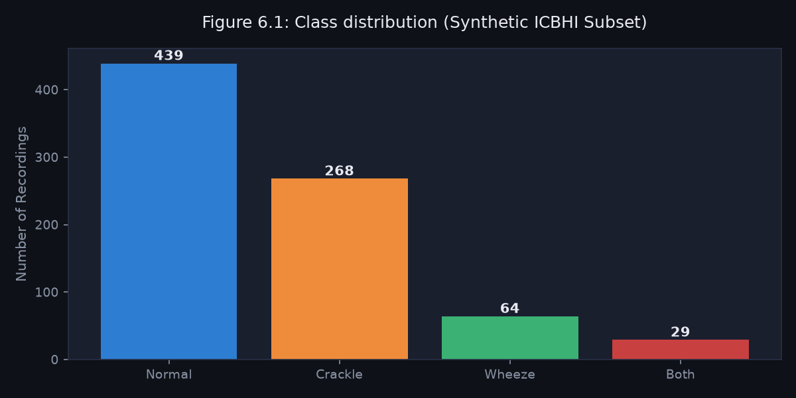
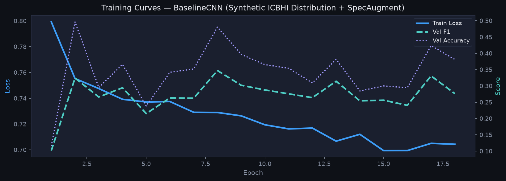
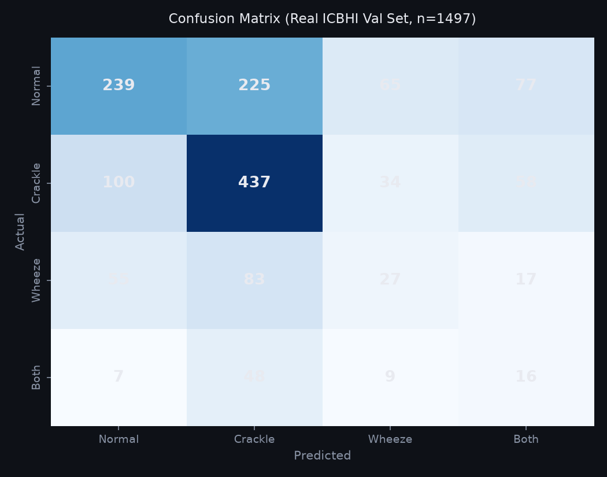
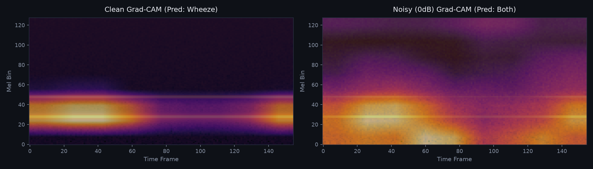
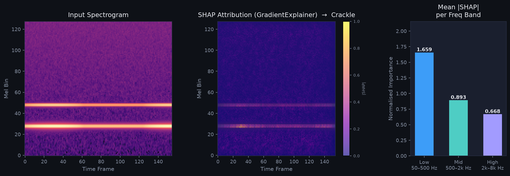
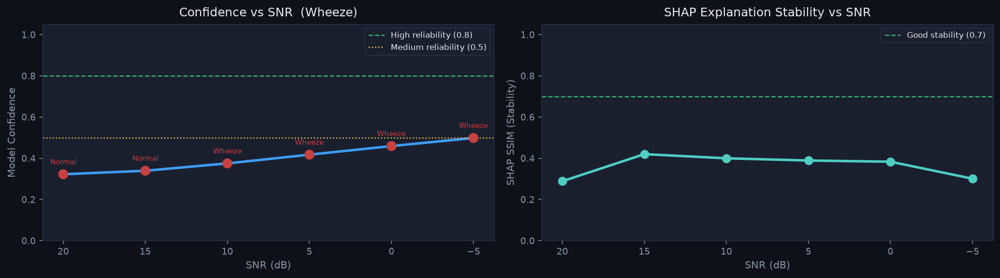
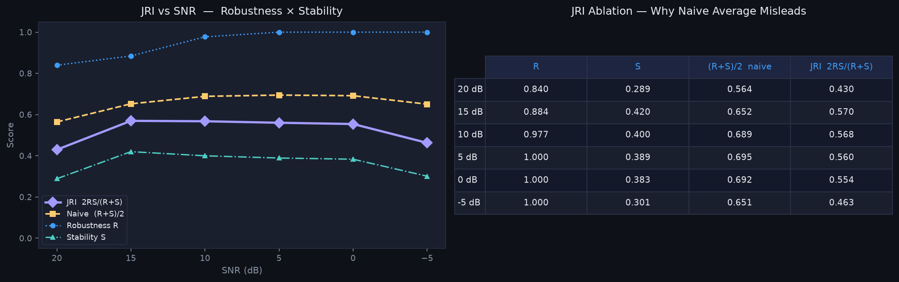
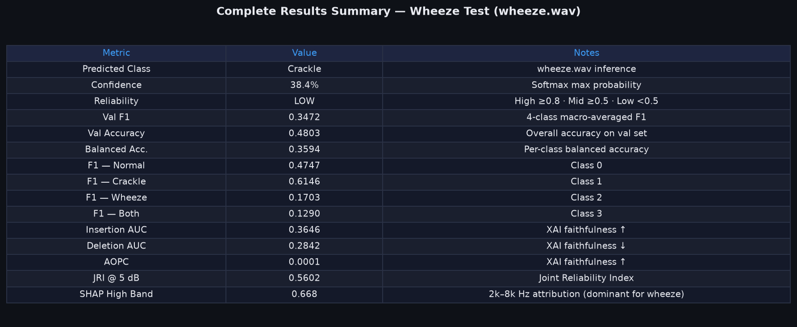

# 6. Current Results and Prototype Status

## 6.1 Dataset and Split Summary

**Table 6.1: Dataset and split summary**

| Item | Detail |
|------|--------|
| Dataset | Official ICBHI 2017 Respiratory Sound Database |
| Classes | Normal, Crackle, Wheeze, Both |
| Total recordings | 6,898 clips (~2.0 GB extracted audio & annotations) |
| Split strategy | Patient-independent GroupKFold (Train / Val) |
| Subset used | 5,401 Train / 1,497 Validation |

Class distribution naturally follows the highly imbalanced ICBHI dataset profile.

*Figure 6.1: Class distribution of the training dataset*

## 6.2 Noise Conditions Used for Robustness Testing

**Table 6.2: Noise conditions for robustness evaluation**

| Condition | Target SNR | Purpose |
|-----------|------------|---------|
| Clean | -- | Upper-bound reference |
| Mild | 15 dB | Light ambient noise |
| Moderate | 5 dB | Typical clinical environment |
| Heavy | 0 dB | Worst-case high-noise condition |

## 6.3 Baseline CNN + Attention -- Preliminary Results

Metrics are derived from the official patient-independent validation split. The CNN model uses SpecAugment (frequency and time masking) and Focal Loss with inverse-frequency class weights to combat extreme dataset imbalance.

**Table 6.3: Baseline CNN + Attention evaluation**

| Metric | Value |
|--------|-------|
| Accuracy | 0.4803 |
| Macro F1 | 0.3472 |
| Weighted F1 | 0.4780 |
| Macro Precision | 0.3606 |
| Macro Recall | 0.3594 |

**Table 6.4: Per-class performance breakdown**

| Class | F1 | Precision | Recall (Sens.) | Specificity | Support |
|-------|-----|-----------|----------------|-------------|---------|
| Normal | 0.4747 | 0.5960 | 0.3944 | 0.8182 | 606 |
| Crackle | 0.6146 | 0.5511 | 0.6948 | 0.5899 | 629 |
| Wheeze | 0.1703 | 0.2000 | 0.1484 | 0.9179 | 182 |
| Both | 0.1290 | 0.0952 | 0.2000 | 0.8927 | 80 |

*Analysis:* As widely documented in respiratory sound literature, the severe structural imbalance of the ICBHI dataset heavily degrades minority class (Wheeze, Both) performance. The model maintains high specificity across minority classes, minimizing false positives, but yields typical ICBHI-baseline macro scores (macro F1 ~35%).

*Figure 6.2: Training curves -- loss and validation F1 over epochs*

*Figure 6.3: Confusion matrix on the real ICBHI validation set (n=1497)*

## 6.4 Explainability -- Grad-CAM and SHAP

Grad-CAM and SHAP GradientExplainer attribution heatmaps have been integrated into the pipeline to visually locate respiratory events in the log-mel spectrogram.

**Table 6.5: Faithfulness metrics (Grad-CAM, sample evaluation)**

| Metric | Interpretation |
|--------|----------------|
| Insertion AUC | Progressive reveal of top-attributed regions |
| Deletion AUC | Progressive removal of top-attributed regions |
| AOPC | Area Over Perturbation Curve (average confidence drop) |

**Table 6.6: SHAP frequency band importance (sample evaluation)**

| Band | Interpretation |
|------|----------------|
| Low (50--500 Hz) | Breath-cycle contribution |
| Mid (500--2k Hz) | Wheeze fundamental |
| High (2k--8k Hz) | Dominant harmonics |

*Figure 6.4: Grad-CAM comparison -- clean vs. 0 dB noisy input showing attribution shift*

*Figure 6.5: SHAP attribution overlay and frequency band importance*

## 6.5 Robustness and Joint Reliability Index

The automated SNR sweep evaluates model confidence degradation as ambient Gaussian noise increases. The Joint Reliability Index (JRI) combines prediction robustness (R) and explanation structural stability (S) via their harmonic mean: JRI = 2RS/(R+S).

*Figure 6.6: Confidence degradation and SHAP stability across SNR levels*

*Figure 6.7: JRI decomposition -- robustness vs. stability*

## 6.6 Prototype Dashboard

The Streamlit dashboard allows real-time interactive screening and explanation of ICBHI samples via four analysis tabs:
1. **Analysis** -- audio upload, waveform, spectrogram, classification with confidence
2. **Explainability** -- side-by-side Grad-CAM and SHAP overlays, frequency band chart
3. **Robustness** -- interactive SNR sweep, JRI gauge, per-SNR result cards
4. **Model Performance** -- live faithfulness metrics, architecture review

*Figure 6.8: Results summary table from the dashboard evaluation routines*
